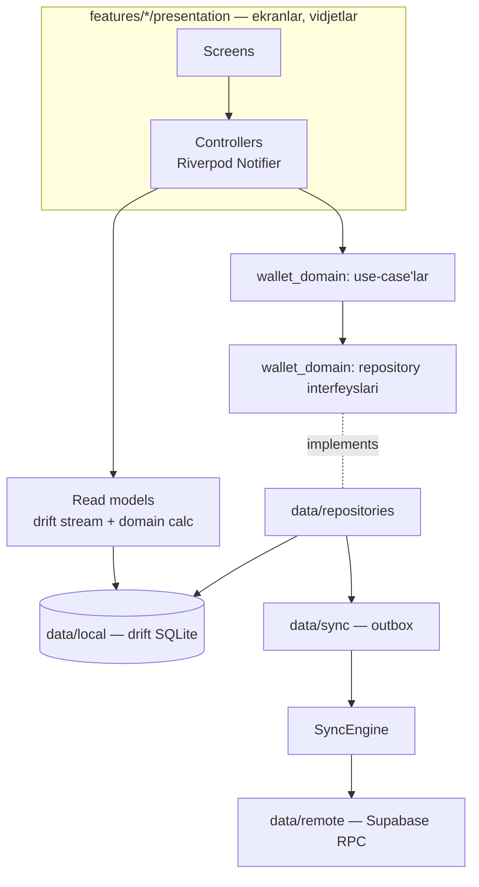

# My Wallet mobil — arxitektura

> Umumiy tizim arxitekturasi va ADR'lar: `my-wallet-admin/docs/ARXITEKTURA.md`.
> Biznes qoidalar (BR-xxx): `contracts/BIZNES-QOIDALAR.md` (admin repodan
> ko'chiriladi). Reja: [`PLAN.md`](PLAN.md). Build va reliz: [`DEPLOY.md`](DEPLOY.md).

---

## 1. Asosiy tamoyillar

1. **Offline-first.** Har amal avval telefondagi bazaga yoziladi, ekran
   darhol yangilanadi, server bilan fonda sinxronlanadi (BR-007).
2. **Dashboard serverga so'rov yubormaydi** — lokal SQLite'dan hisoblanadi
   (DB yuklamasi talabi). Serverga faqat o'zgarishlar ketadi/keladi.
3. **Clean Architecture + feature-first.** Biznes qoidalar sof Dart
   paketida (`wallet_domain`) — Flutter ham, Supabase ham bilmaydi,
   soniyalarda testlanadi.
4. **Server — hakam.** Lokal hisob (tegishli oy, holat) — taxmin; sinxronda
   server qaytargan kanonik qiymat yoziladi.
5. **Parite.** Lokal hisoblar admin repodagi golden fixture'lar bilan bir xil
   natija berishi CI'da tekshiriladi (`contracts/fixtures`).

---

## 2. Qatlamlar



**Bog'liqlik faqat ichkariga:** `presentation → application → domain ←
data`. `wallet_domain` hech narsaga bog'liq emas (faqat `meta`,
`collection`). Qoida `import_lint`/`custom_lint` bilan majburiy.

---

## 3. Repo tuzilmasi

```
my-wallet-mobil/
├── lib/
│   ├── main_dev.dart · main_staging.dart · main_prod.dart
│   ├── bootstrap.dart              # DI, xato ushlagich, Firebase (kechiktirilgan)
│   ├── app/                        # App, router (go_router), tema, l10n
│   ├── core/
│   │   ├── design_system/          # tokenlar, tipografiya, komponentlar
│   │   ├── format/                 # pul, sana, oy nomlari (uz/ru/en)
│   │   ├── security/               # ilova qulfi, maxfiylik rejimi
│   │   ├── connectivity/ · logging/ · errors/
│   ├── data/
│   │   ├── local/                  # drift: jadvallar, DAO, migratsiyalar
│   │   ├── remote/                 # Supabase RPC klienti, DTO
│   │   ├── sync/                   # outbox, SyncEngine, mapperlar
│   │   └── repositories/           # domain interfeyslari implementatsiyasi
│   └── features/
│       ├── auth/ onboarding/ shell/
│       ├── dashboard/ transactions/ payments/
│       ├── wallet/ (accounts, personal_fund, savings, debts, goals, limits)
│       ├── reports/ notifications/ settings/
│       └── <feature>/{presentation,application}/
├── packages/
│   └── wallet_domain/              # ★ SOF DART
│       ├── lib/src/value_objects/  # Money, Currency, MonthKey, LocalDate
│       ├── lib/src/entities/
│       ├── lib/src/rules/          # BR qoidalari — sof funksiyalar
│       ├── lib/src/repositories/   # interfeyslar
│       └── lib/src/usecases/
├── contracts/                      # admin repodan (o'zgartirilmaydi)
├── contracts.lock                  # manba commit + sha256
├── l10n/                           # app_uz.arb, app_ru.arb, app_en.arb
├── integration/ · test/           # integration — lokal Supabase bilan (host)
├── tool/                           # sync_contracts.sh, integration.sh, check_coverage.dart
└── docs/
```

Pub workspace: ildiz (Flutter ilova) + `packages/wallet_domain`.

---

## 4. Texnologiyalar

| Soha | Tanlov | Sabab |
|---|---|---|
| State / DI | Riverpod 3 + `riverpod_generator` | testlanadigan, `autoDispose` bilan listenerlar faqat ekran ochiqda |
| Navigatsiya | go_router (`StatefulShellRoute`) | 4 tab + markaziy FAB, deep link (taklif, auth) |
| Lokal baza | drift (SQLite) | tipli SQL, reaktiv `watch()`, migratsiyalar, agregat SQL'da |
| Backend | `supabase_flutter` | auth (PKCE), RPC |
| Modellar | `freezed` + `json_serializable` | immutable, `copyWith`, union holatlar |
| Grafiklar | `fl_chart` | donut, ustun, chiziq |
| Auth | `google_sign_in` (native → `signInWithIdToken`), email OTP | bepul |
| Xavfsizlik | `local_auth`, `flutter_secure_storage` | PIN/biometrika, sessiya |
| Bildirishnoma | `firebase_messaging`, `flutter_local_notifications` | push + offline lokal eslatma |
| Kuzatuv | Firebase Crashlytics | bepul |
| Rasm | `image_picker` + `flutter_image_compress` | chek ≤ 1 MB |
| QR | `mobile_scanner` (o'qish), `qr` (chizish — bitta `CustomPainter`) | taklif QR va fiskal chek (E30, E33) |
| Vidjet | `home_widget` | bosh ekran vidjeti (E33-T01) |
| Lint | `very_good_analysis` + `custom_lint` | qat'iy qoidalar |
| Test | `test`, `flutter_test`, `mocktail`, `alchemist` (golden), `patrol` (e2e) | |

---

## 5. Sinxron dvigatel (SyncEngine)

**Lokal jadvallar:** serverdagi sinxron jadvallarning nusxasi + `row_version`,
`deleted_at`; qo'shimcha: `outbox`, `sync_state` (byudjet bo'yicha kursor),
`sync_issues` (to'qnashuv/rad etish — UI uchun).

**Yozish (masalan xarajat qo'shish):**
1. Use-case domen qoidalarini tekshiradi (summa > 0, kategoriya bor …),
   tegishli oyni hisoblaydi (BR-040/041 — taxmin).
2. **Bitta drift tranzaksiyasida:** qator `transactions` ga + mutatsiya
   `outbox` ga (`mutation_id` = UUIDv7, `base_version` = lokal `row_version`).
3. Drift `watch()` → dashboard va ro'yxat darhol yangilanadi.
4. SyncEngine'ga signal (debounce 1 s).

**Push:** outbox'dan tartib bo'yicha ≤ 100 → `sync_push` → natijalar bitta
lokal tranzaksiyada: `ok` → kanonik qator yoziladi, outbox'dan o'chadi;
`conflict` → server qatori yoziladi + `sync_issues` (foydalanuvchiga
"boshqa qurilmada o'zgargan"); `rejected` → lokal o'zgarish qaytariladi
(qator serverdan qayta olinadi) + `sync_issues` xato matni bilan.
Bir qatorning ketma-ket offline tahrirlari outbox'da **birlashtiriladi**.

**Pull:** `sync_pull(cursor)` `has_more = false` bo'lguncha; outbox'da
kutayotgan mutatsiyasi bor qatorlar ustiga yozilmaydi; kursor saqlanadi;
`resync_required` → byudjet lokal ma'lumoti tozalanib to'liq yuklanadi.

**Qachon ishlaydi:** ilova ochilganda, yozuvdan keyin, tarmoq tiklanganda,
ilova oldinga chiqqanda, "tortib yangilash", fon (Android WorkManager —
har 6 soatda, faqat tarmoq bo'lsa).

**Holat UI:** `SyncStatusBadge` (✓ sinxron · ↻ yuborilmoqda · 📴 oflayn ·
⚠️ N ta muammo) → "Sinxron holati" ekrani.

---

## 6. Lokal hisob-kitob (dashboard)

```
drift SQL: month_facts(household, month)      ← serverdagi private.month_facts bilan bir xil ma'no
   → wallet_domain: MonthSummaryCalc (BR-090/091)
   → ForecastCalc (BR-093), SafeToSpend (BR-094)
   → LimitCalc (BR-130), SavingsCalc (BR-100), DebtCalc (BR-112), GoalCalc (BR-121)
```

- Agregatlar SQLite'da (`SUM ... GROUP BY`, indeks: `(household_id,
  budget_month)`) — Dart'da minglab qatorni aylanib chiqish yo'q.
- Hosila formulalar faqat `wallet_domain/rules` da — **bitta joy**.
- Parite: `contracts/fixtures/*.json` → (a) domen testlari, (b) drift DAO
  testlari (in-memory SQLite) — ikkalasi kutilgan natijaga teng.

---

## 7. Ekranlar va navigatsiya (UX)

Pastki navigatsiya: **Xulosa · Amallar · (＋) · To'lovlar · Hamyon**;
sozlamalar — yuqoridagi avatar orqali.

| Ekran | Asosiy elementlar | Qoidalar |
|---|---|---|
| **Xulosa** | oy almashtirgich (swipe), QOLDIQ hero + prognoz, "kuniga ≈ X so'm", orttirgan % halqa, 4 stat (daromad/xarajat/karta/naqd), reja bajarilishi, yaqin to'lovlar (bir bosishda "To'landi"), kategoriyalar limit rangi bilan, daromad turlari, 👤 fond va 🏦 jamg'arma alohida plitalar, qarz/maqsad qisqacha, prognoz kartasi | BR-090..102, BR-005 |
| **Qo'shish (＋)** | Xarajat / Daromad / O'tkazma; katta summa + raqamli klaviatura (`000`, `+ −`); tez tugmalar; kategoriya to'ri (oxirgilar oldinda); hisob chiplari; Bugun/Kecha/sana; payee avto-to'ldirish; **"→ Avgust 2026 oyining daromadi"** jonli izoh va oyni almashtirish; boshqa valyutadagi hisobda kurs va `≈ ekvivalent` (E29), turli valyutali o'tkazmada manzil summasi; chek QR skaneri (E33-T02); qarz/teg/izoh/chek | BR-040..056, BR-141, BR-191..193 |
| **Amallar** | kun bo'yicha guruh, kunlik jami, qidiruv, filtr chiplari, swipe → o'chirish + undo, yopilgan oy banneri | BR-009, BR-055, BR-202 |
| **To'lovlar** | Xarajatlar / Kutilayotgan daromadlar; ⚠️ kechikkan · 📌 bugun · 🗓 yaqin · keyinroq · ✅ to'langan; summa maydoni + "To'landi" (qisman/yopish), o'tkazib yuborish, avto to'lov va qarz belgilari, `X so'm + N ta ?`, "Oyni ochish" (preview), kalendar ko'rinishi | BR-070..085 |
| **Hamyon** | hisoblar va qoldiqlar, o'tkazma; 👤 shaxsiy fond (qoldiq, ajratma/sarf, sarf qo'shish, tarix); 🏦 jamg'arma (grafik, oylar ⏳); 💳 qarzlar (3 holat, progress, tugash); 🎯 maqsadlar; 📊 limitlar | BR-020..025, 060..065, 100..103, 110..123, 130..134 |
| **Sozlamalar** | profil, byudjet(lar), **a'zolar** (ro'yxat, rollar, taklif — kod/havola/QR, chiqarish/chiqish), bildirishnomalar + Telegram, ilova qulfi, maxfiylik rejimi, tema, til, eksport, sinxron holati, akkauntni o'chirish, ilova haqida | BR-011..015, 160..168, 211..214 |
| **Bosh ekran vidjeti** (E33-T01) | joriy oy qoldig'i, "kuniga ≈ X", "＋" (qo'shish varag'iga deep link); maxfiylik rejimida summalar "•••" | BR-094, BR-212 |
| **Onboarding** | kirish → byudjet yaratish/qo'shilish → hisoblar va boshlang'ich qoldiq → maosh jadvali (daromad turlari va qaysi oyga tegishli) → doimiy to'lovlar (tayyor ro'yxatdan) → 👤 fond qoidasi → bildirishnoma ruxsati → joriy oy avtomatik ochiladi | BR-010, BR-031, BR-060, BR-080 |

**Dizayn tizimi:** Material 3 + o'z tokenlarimiz (`ThemeExtension`:
income/expense/warning/danger/muted, bo'shliqlar, radiuslar), light/dark,
raqamlar `tabularFigures`, 48 dp teginish maydoni, matn 200% gacha
kattalashtirilganda buzilmaydi, haptic (saqlash, to'lash), skeleton
yuklanish, bo'sh holat illyustratsiyalari, animatsiyalar 200–300 ms.

---

## 8. Xavfsizlik

- Sessiya `flutter_secure_storage` da; PIN — tuz + hash (PBKDF2),
  biometrika `local_auth`; fonda N daqiqadan keyin qulf (BR-211).
- Ilova almashtirgichda ekran yashiriladi (Android `FLAG_SECURE` —
  sozlamada yoqiladi).
- Maxfiylik rejimi: `MoneyText` markazlashgan — bitta provider barcha
  summalarni `•••` qiladi (BR-212).
- Lokal baza — ilova sandbox'ida; akkaunt o'chirilganda tozalanadi.
- Minimal versiya: `app_bootstrap.min_version` > joriy → "Yangilash kerak"
  ekrani (BR-214).
